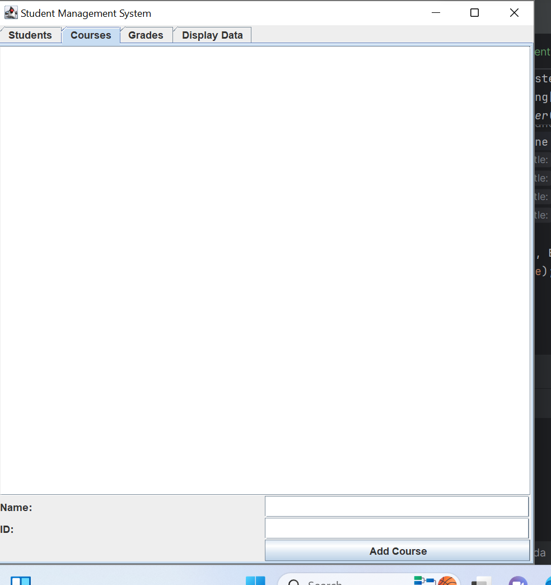
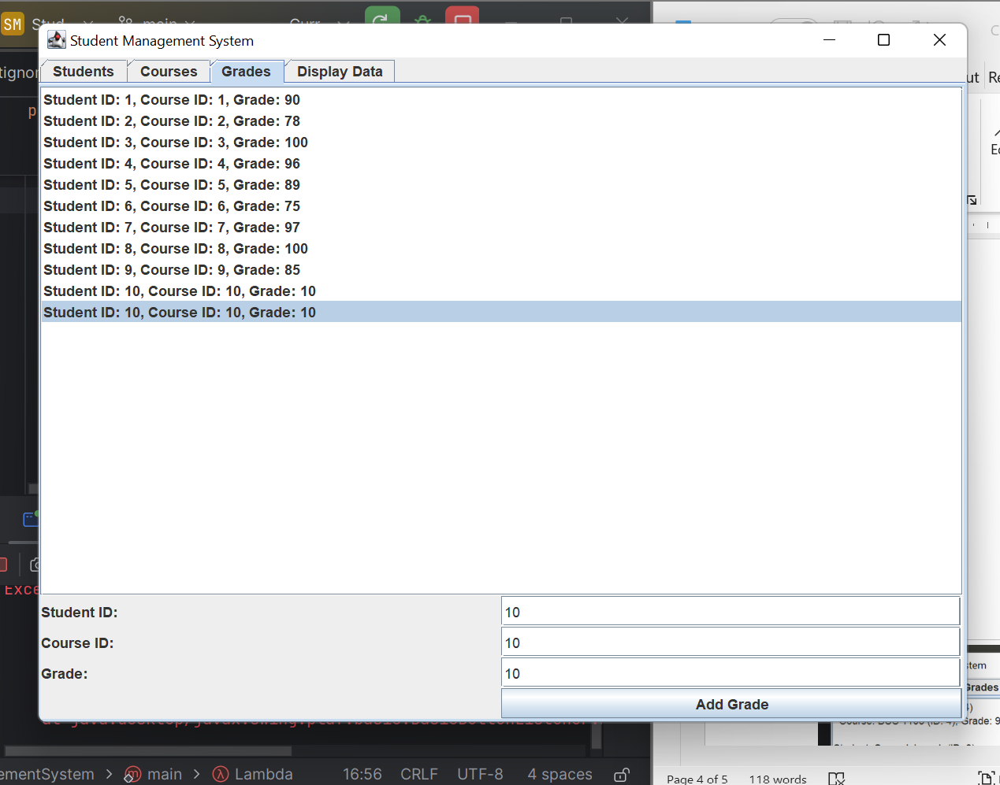
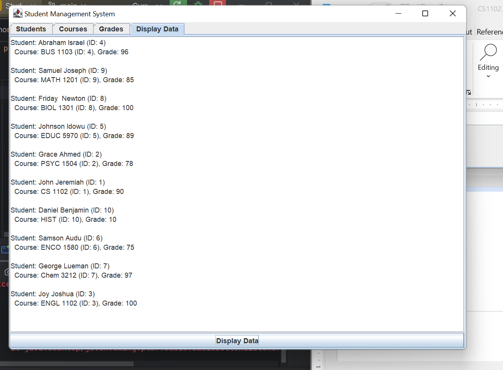

<i class="UOPeople-Logo.png"></i>
Student Management System
Overview
The Student Management System is a Java-based GUI application designed to help administrators manage student records, course enrollment, and grades efficiently. The application provides a user-friendly interface built using Java Swing, allowing users to add, update, and view student information, enroll students in courses, and assign grades. It also includes a feature to display all student-course-grade relationships in a structured format.

Features
Student Management:

Add new students with details such as name and ID.

View a list of all students and their details.

Course Management:

Add new courses with details such as name and ID.

View a list of all courses and their details.

Grade Management:

Assign grades to students for enrolled courses.

View a list of all grades and their details.

Display Data:

View all student-course-grade relationships in a structured format.

Dynamic Interface:

The GUI updates dynamically to reflect changes in student records, course enrollment, and grades.

Error Handling:

Displays error messages for invalid inputs or operations.

Technologies Used:
Java: The core programming language used for development.

Java Swing: Used for building the graphical user interface (GUI).

Object-Oriented Programming (OOP): The application is designed using OOP principles for modularity and maintainability.

Class Structure
The application is divided into several classes, each responsible for a specific functionality:

Main Classes:

StudentManagementSystem: The entry point of the application. Initializes the JFrame and sets up the tabs.

DataModel: Manages the data for students, courses, and grades.

Entity Classes:

Student: Represents a student with attributes like name and ID.

Course: Represents a course with attributes like name and ID.

Grade: Represents a grade with attributes like student ID, course ID, and grade.

GUI Panels:

StudentPanel: Provides a GUI for managing students.

CoursePanel: Provides a GUI for managing courses.

GradePanel: Provides a GUI for managing grades.

DisplayDataPanel: 
Provides a GUI for displaying student-course-grade relationships.

How to Run the Program
Prerequisites
Java Development Kit (JDK): 
Ensure you have JDK 11 or later installed.

IDE: Use an IDE like IntelliJ IDEA or Eclipse for easier setup and running.

Steps to Run
Clone the Repository:

git clone https://github.com/Ojobumiche/StudentManagentSystem-GUI.git
cd StudentManagementSystem
Open the Project in Your IDE:

Import the project into your IDE (e.g., IntelliJ IDEA or Eclipse).

Run the Application:

Locate the StudentManagementSystem class in the src directory.

Run the main method in the StudentManagementSystem class.

Interact with the GUI:

Use the tabs to manage students, courses, and grades.

Click the Display Data button to view all student-course-grade relationships.

Usage Instructions
Student Management
Navigate to the Students tab.

To add a student:

Enter the student's name and ID in the form.

Click the Add Student button.

Course Management
Navigate to the Courses tab.

To add a course:

Enter the course's name and ID in the form.

Click the Add Course button.

Grade Management
Navigate to the Grades tab.

To assign a grade:

Enter the student ID, course ID, and grade in the form.

Click the Add Grade button.

Display Data
Navigate to the Display Data tab.

Click the Display Data button to view all student-course-grade relationships.

Error Handling
If invalid inputs are provided (e.g., empty fields or non-numeric IDs), an error message will be displayed.

If a student or course is not found when assigning a grade, an error message will be displayed.

Screenshots
Course Management

Grade Management
Grade Management

Display Data
Display Data

Contributing
Contributions are welcome! If you'd like to contribute to this project, please follow these steps:

Fork the repository.

Create a new branch for your feature or bugfix.

Commit your changes and push them to your fork.

Submit a pull request with a detailed description of your changes.

License
This project is licensed under the MIT License. See the LICENSE file for details.

Contact
For questions or feedback, please contact:

Name: JOSHUA MONDAY

Email: bumiche@gmail.com

GitHub: Ojobumiche